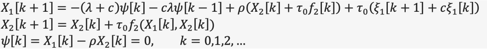
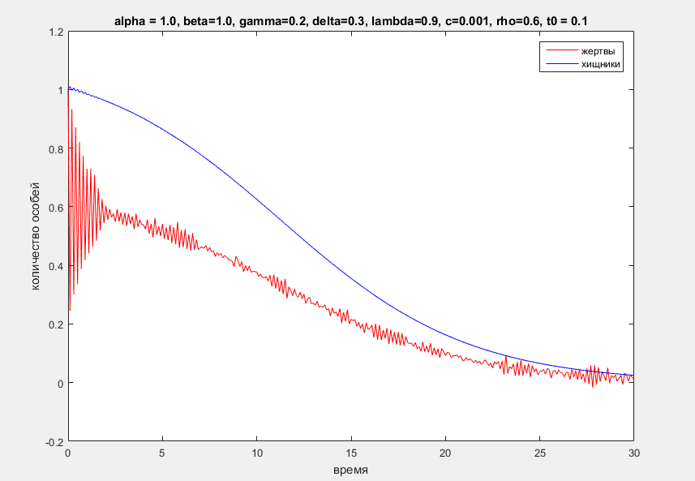
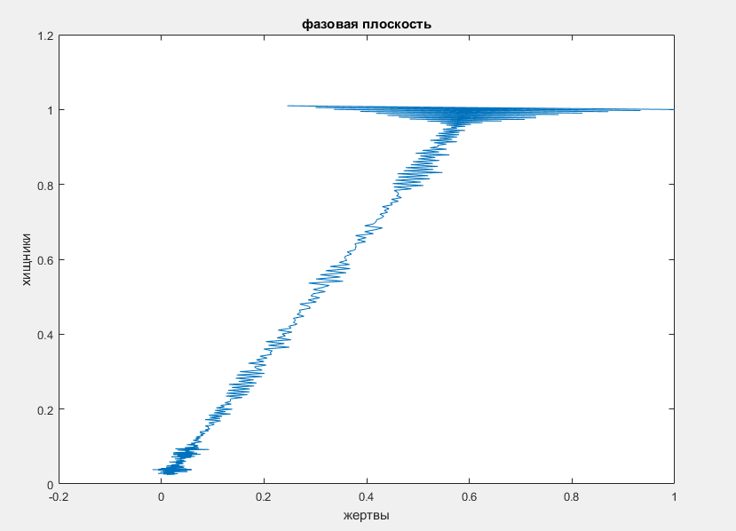

Model-Predator-Prey
===================

Исследование системы дифференциальных уравнений Лотки-Вольтерра (модель "Хищник-жертва") с управлением по переменной X1 (жертвы) со стохастическими возмущениями. Реализовано в MatLab численное решение данной системы методом Эйлера. Стохастические случаи: 1. пропорциональность X1 и X2.

Версия MatLab на момент написания инструкции R2015b.
Для получения всех возможных адекватных коэффициентов системы необходимо открыть скрипт main.m и запустить его (кнопка “Run”). Результат работы скрипта будет записан в текстовый файл parametrs.txt.
Чтобы построить графики зависимости двух особей, нужно взять любые коэффициенты (одна любая строчка) из файла parametrs.txt и воспользоваться скриптом print.m, либо интерфейсом.
Для использования скрипта print.m достаточно вписать коэффициенты с 1 по 7 строчку и выполнить его (кнопка “Run”).
Для использования интерфейса необходимо запустить среду “guide” (написать “guide” в командной строке и нажать клавишу “Enter”). Затем в окне открытия файла выбрать interface.m и нажать кнопку “Open”. После этого зажать комбинацию клавиш ctrl + T и ввести коэффициенты в соответствующие поля.

